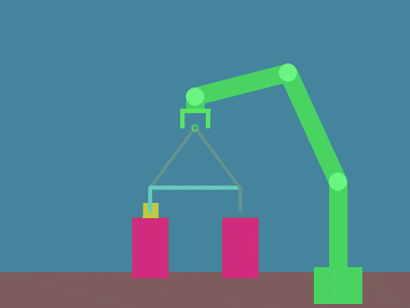

# robot2d

This is a little educational robot simulation using Python, Box2D and PyGame

## Dependencies

This simulation was designed to work with Python 3.5.x, Box2D 2.3.x, PyGame 1.9.x and NumPy 1.15.x.

## How to use

The PyGame window is interactive, below are some details

- To apply a force to an object, hover the mouse pointer over the object, then click and hold, dragging to the direction you want to apply the force.

- To draw a path just move the mouse pointer to somewhere where there is no object under it, then click and hold, dragging the mouse, drawing the path. While drawing a path you can press shift to tell the gripper to close, or release shift to tell the gripper to open.

- To turn on the joint actuators, press enter. To switch them off, just press enter again.

- To start following the path, press space. To stop following a path, press enter again

For more details on how to implement stuff programmatically look at the examples and look at the code of the simulator. It should be more or less straightforward to understand it.

